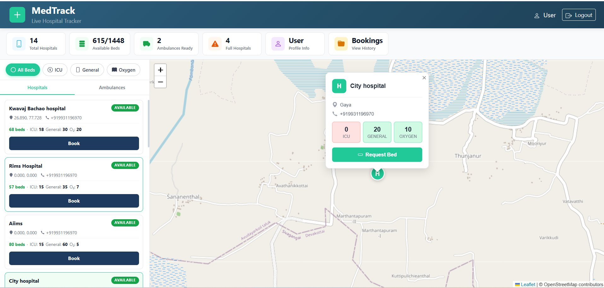
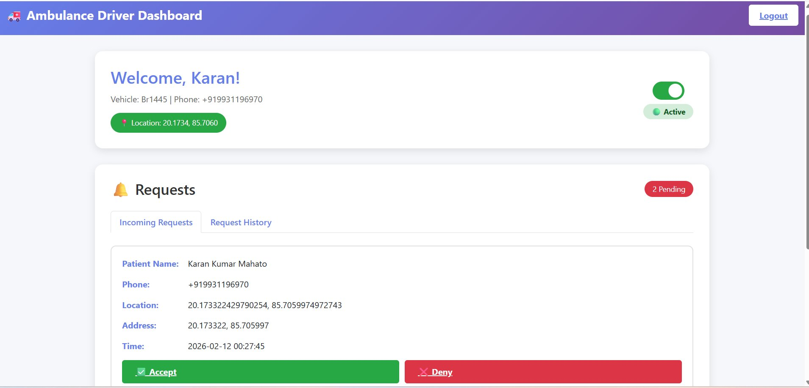
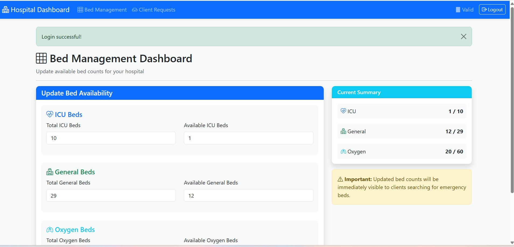

# 🚑 Xplora - Smart Ambulance Tracking System

<div align="center">

[](https://flask.palletsprojects.com/)
[](https://www.python.org/)
[](https://www.sqlite.org/)

*Bridging the gap between emergency and care - because every second counts.*

</div>

---

## 📸 Screenshots

<div align="center">

### Patient Portal - Live Hospital Tracker

*Real-time hospital bed availability and ambulance tracking on interactive map*

### Ambulance Driver Dashboard  

*Driver interface for managing incoming requests and updating location*

### Hospital Bed Management

*Hospital admin panel for managing bed inventory across ICU, General, and Oxygen wards*

</div>

---

## 🌟 The Problem

In emergency situations, every second matters. Yet, people face critical challenges:

```
❌ No real-time ambulance tracking
❌ Uncertainty about ambulance arrival times
❌ Difficulty finding available ambulances nearby
❌ Manual, time-consuming booking processes
❌ No transparency in ambulance locations
❌ Poor coordination between hospitals and ambulances
```

**The Result?** Delayed medical assistance and increased anxiety during emergencies.

---

## ✨ How Xplora Fixes This

Xplora transforms emergency medical response with:

```
✅ Real-time GPS tracking of ambulances
✅ Instant ambulance booking with OTP verification
✅ Live location updates for patients and hospitals
✅ Smart matching of nearest available ambulances
✅ Transparent communication via SMS notifications
✅ Centralized dashboard for hospital staff
```

**The Impact:** Faster response times, better coordination, and peace of mind during emergencies.

---

## 🎯 What Makes Xplora Unique

| Traditional Systems | 🚀 Xplora |
|---|---|
| Static ambulance locations | **Real-time GPS tracking** |
| Phone-based manual booking | **One-tap digital booking** |
| No transparency | **Live tracking dashboard** |
| Single-sided information | **Multi-stakeholder platform** |
| No verification | **OTP-based security** |
| Delayed updates | **Instant SMS notifications** |

**Our Edge:** Xplora brings together patients, ambulances, and hospitals on a unified real-time platform - something missing in traditional emergency response systems.

---

## 🏗️ System Architecture

```
┌─────────────────────────────────────────────────────────────┐
│                    XPLORA ECOSYSTEM                         │
└─────────────────────────────────────────────────────────────┘

    ┌──────────────┐         ┌──────────────┐         ┌──────────────┐
    │   PATIENT    │         │  AMBULANCE   │         │   HOSPITAL   │
    │    PORTAL    │         │    PORTAL    │         │   DASHBOARD  │
    └──────┬───────┘         └──────┬───────┘         └──────┬───────┘
           │                        │                        │
           │  Book Ambulance        │  Update Location       │  Track All
           │  Track Status          │  Accept Requests       │  Manage Fleet
           │                        │                        │
           └────────────────────────┼────────────────────────┘
                                    │
                         ┌──────────▼──────────┐
                         │   FLASK BACKEND     │
                         │                     │
                         │  ┌───────────────┐  │
                         │  │ Authentication│  │
                         │  │  (OTP + SMS)  │  │
                         │  └───────────────┘  │
                         │                     │
                         │  ┌───────────────┐  │
                         │  │   Location    │  │
                         │  │    Service    │  │
                         │  └───────────────┘  │
                         │                     │
                         │  ┌───────────────┐  │
                         │  │   Booking     │  │
                         │  │   Engine      │  │
                         │  └───────────────┘  │
                         └──────────┬──────────┘
                                    │
                    ┌───────────────┼───────────────┐
                    │               │               │
              ┌─────▼─────┐   ┌────▼────┐   ┌─────▼──────┐
              │  SQLite   │   │ HTTPSMS │   │   Static   │
              │ Databases │   │   API   │   │   Assets   │
              └───────────┘   └─────────┘   └────────────┘
                  │               │
         ┌────────┼───────┬───────┘
         │        │       │
    clients.db  user.db  ambulances.db
```

### Data Flow

```
1. BOOKING FLOW
   Patient → Request Ambulance → OTP Sent → Verify → Match Nearest → Accept → Track

2. LOCATION UPDATE FLOW
   Ambulance → Update GPS → Database → Broadcast → All Connected Clients

3. HOSPITAL MONITORING FLOW
   Dashboard → Fetch All Ambulances → Display Map → Real-time Updates
```

---

## 🛠️ Tech Stack

### Backend
- **Framework:** Flask 3.0.0
- **Language:** Python 3.8+
- **Database:** SQLite3
- **API Integration:** HTTPSMS for OTP

### Frontend
- **HTML5** for structure
- **CSS3** for styling
- **JavaScript** for interactivity
- **Leaflet Maps** for real-time tracking

### Why This Stack?

- **Flask**: Lightweight, perfect for rapid prototyping and real-time features
- **SQLite**: Zero-config, reliable for location data and user management
- **HTTPSMS**: Instant OTP delivery for security
- **Modular Design**: Separate portals for scalability

---

## 🚀 Quick Start

### Prerequisites
```bash
Python 3.8+
pip package manager
```

### Installation

1. **Clone the repository**
```bash
git clone https://github.com/windzer99311/xplora.git
cd xplora
```

2. **Set up Patient Portal**
```bash
cd hospital_tracker_client
pip install -r requirements.txt
python app.py
# Access at: http://localhost:5000
```

3. **Set up Ambulance Portal**
```bash
cd ../ambulance_side
pip install -r requirements.txt
python app.py
# Access at: http://localhost:5001
```

4. **Set up Hospital Dashboard**
```bash
cd ../hospital_side/hospital_dashboard
# Follow setup instructions
```

---

## 📱 Features Breakdown

### 🏥 Patient Portal
- **Quick Booking**: One-tap ambulance request
- **OTP Security**: SMS-based verification
- **Live Tracking**: Real-time ambulance location
- **Booking History**: Track past requests
- **Status Updates**: Know when help arrives

### 🚑 Ambulance Portal
- **Driver Dashboard**: Manage incoming requests
- **GPS Integration**: Auto-update location
- **Request Management**: Accept/decline bookings
- **Profile Management**: Update vehicle details
- **Active Status**: Toggle availability

### 🏥 Hospital Dashboard
- **Fleet Overview**: Monitor all ambulances
- **Map Visualization**: See real-time locations
- **Request Analytics**: Track booking patterns
- **Staff Management**: Control access
- **Emergency Alerts**: Priority notifications

---

## 👥 Team

| Karan Kumar Mahato | Yuvraj Sha | Ankit Kumar | Abinash Pradhan |
|:---:|:---:|:---:|:---:|
| [](https://github.com/windzer99311) | [](https://github.com/) | [](https://github.com/) | [](https://github.com/) |
| [@windzer99311](https://github.com/windzer99311) | @yuvrajsha | @ankitkumar | @abinashpradhan |

---

## 🗺️ Roadmap

### ✅ Implemented Features
- Real-time ambulance GPS tracking
- OTP-based authentication via SMS
- Hospital bed availability management (ICU, General, Oxygen)
- Interactive map with hospital and ambulance markers
- Live location updates
- Request management system
- Multi-portal architecture (Patient, Ambulance, Hospital)
- Booking history tracking

### 🚀 Future Enhancements
- Mobile app (Android & iOS)
- AI-powered ambulance routing optimization
- Multi-language support
- Payment gateway integration
- Emergency contact auto-notification
- Advanced analytics dashboard
- Push notifications for real-time alerts

---

## 🤝 Contributing

We welcome contributions! Here's how you can help:

1. Fork the repository
2. Create your feature branch (`git checkout -b feature/AmazingFeature`)
3. Commit your changes (`git commit -m 'Add some AmazingFeature'`)
4. Push to the branch (`git push origin feature/AmazingFeature`)
5. Open a Pull Request

---

<div align="center">

**Made with ❤️ and ☕ by the Xplora Team**

⭐ Star us on GitHub — it helps!

[Back to top ↑](#-xplora---smart-ambulance-tracking-system)

</div>
